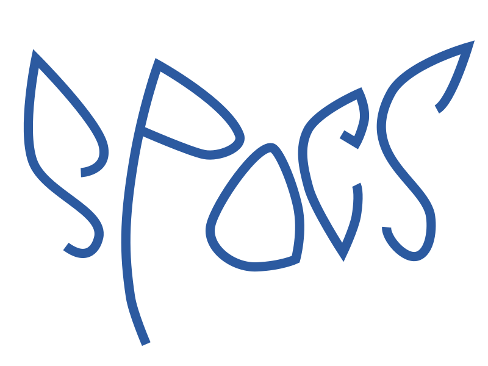

# SPOCS

__SPOCS__ is a software library written in modern Fortran for
efficiently computing descriptive statistical moments and
co-moments. The [SPOCS acronym] stands for:

* [__S__ ingle-point]
* [__P__ arallel]
* [__O__ nline]
* [__C__ onverging]
* [__S__ tatistics]

[SPOCS acronym]: ./SPOCS-definition.md
[__S__ ingle-point]: ./SPOCS-definition.md#single-point
[__P__ arallel]: ./SPOCS-definition.md#parallel
[__O__ nline]: ./SPOCS-definition.md#online
[__C__ onverging]: ./SPOCS-definition.md#converging
[__S__ tatistics]: ./SPOCS-definition.md#statistics
